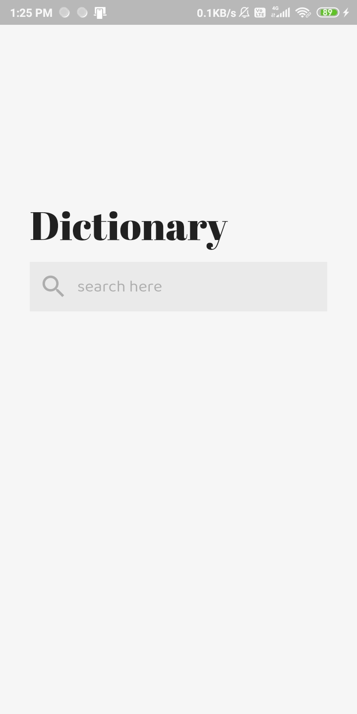

# Dictionary
[Get it on Google Play](https://play.google.com/store/apps/details?id=com.adarshverma.dictionaryapp&hl=en_US) 
A minimal-design dictionary app created with **Flutter**. 
Almost every definition for a word
with examples. 
Powered by the OwlBot API.
 
*requires internet connection.*

# Screenshots

 
 
 

[UI Design Taken from Dribbble by Yoshiki Schmitz](https://dribbble.com/shots/6029129-Minimal-Dictionary-App)
